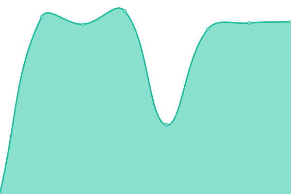
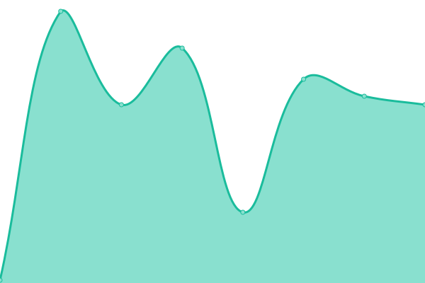

# [📈 Live Status](http://status.gorakulist.kr/): <!--live status--> **🟧 Partial outage**

This repository contains the open-source uptime monitor and status page for [Upptime](https://upptime.js.org), powered by [Upptime](https://github.com/upptime/upptime).

With [Upptime](https://upptime.js.org), you can get your own unlimited and free uptime monitor and status page, powered entirely by a GitHub repository. We use [Issues](https://github.com/upptime/upptime/issues) as incident reports, [Actions](https://github.com/DetegiCE/gorakulist-uptime/actions) as uptime monitors, and [Pages](http://status.gorakulist.kr/) for the status page.

<!--start: status pages-->
<!-- This summary is generated by Upptime (https://github.com/upptime/upptime) -->
<!-- Do not edit this manually, your changes will be overwritten -->
<!-- prettier-ignore -->
| URL | Status | History | Response Time | Uptime |
| --- | ------ | ------- | ------------- | ------ |
|  [GorakuList](https://www.gorakulist.kr/) | 🟥 Down | [goraku-list.yml](https://github.com/DetegiCE/gorakulist-uptime/commits/HEAD/history/goraku-list.yml) | 

 949ms
     
 | 

<a href="https://status.gorakulist.kr/history/goraku-list">100.00%</a>
    

|  [Google](https://www.google.com) | 🟩 Up | [google.yml](https://github.com/DetegiCE/gorakulist-uptime/commits/HEAD/history/google.yml) | 

 95ms
     
 | 

<a href="https://status.gorakulist.kr/history/google">100.00%</a>
    

|  [Imgur](https://imgur.com/) | 🟩 Up | [imgur.yml](https://github.com/DetegiCE/gorakulist-uptime/commits/HEAD/history/imgur.yml) | 

 53ms
     
 | 

<a href="https://status.gorakulist.kr/history/imgur">100.00%</a>
    

<!--end: status pages-->

[**Visit our status website →**](http://status.gorakulist.kr/)

## 📄 License

- Powered by: [Upptime](https://github.com/upptime/upptime)
- Code: [MIT](./LICENSE) © [Upptime](https://upptime.js.org)
- Data in the `./history` directory: [Open Database License](https://opendatacommons.org/licenses/odbl/1-0/)
